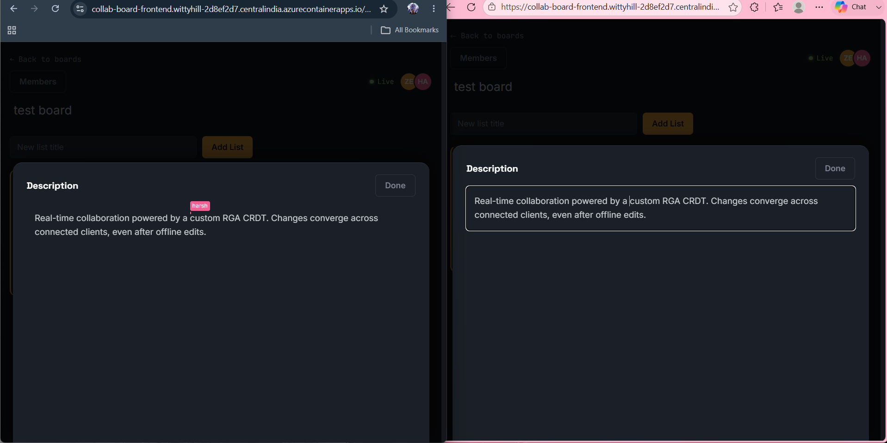

# Collab Board

A real-time collaborative Kanban board with Google-Docs-style live editing — built to explore how conflict-free replicated data types (CRDTs) and WebSocket presence systems work under the hood, not just to use a library that does it for you.

**🔗 Live demo:** [collab-board-frontend.wittyhill-2d8ef2d7.centralindia.azurecontainerapps.io](https://collab-board-frontend.wittyhill-2d8ef2d7.centralindia.azurecontainerapps.io)

> Hosted on Azure Container Apps' consumption tier, which scales to zero when idle. The first request after a period of inactivity may take 15–30 seconds to cold-start — that's expected, not a bug.

---

## Preview



*Two browser sessions editing the same card description in real time, with a live cursor label showing who's typing where.*

---

## Overview

Collab Board is a multi-user Kanban board (think Trello) where every field — board name, list name, card name, and card description — supports live, Google-Docs-style collaborative editing. There's no save button, no edit-mode toggle, and no lock-based conflict handling. Multiple people can type in the same field at the same time, and every client converges on the same final text, even across dropped connections and offline edits.

The project was built to go deep on two things that most CRUD apps never touch: a **custom CRDT implementation** for conflict-free concurrent text editing, and a **WebSocket presence and cursor-tracking system** that shows collaborators' cursors moving live, the way Google Docs or Figma do.

---

## Key Features

- **Live collaborative editing** on board titles, list titles, card titles, and card descriptions — no save button, changes sync character-by-character
- **Live cursor presence** — see exactly where other collaborators are typing, labeled with their username
- **Presence indicators** — avatar stack showing who's currently active on a board
- **Conflict-free concurrent editing** — powered by a custom RGA CRDT (see below), so simultaneous edits never overwrite each other
- **Board membership & roles** — admins can approve join requests and manage members
- **Drag-and-drop** card/list reordering, synced live across all connected clients
- **JWT authentication** with persistent sessions
- **Full CI/CD pipeline** — every push to `main` builds, pushes, and deploys automatically to Azure

---

## Engineering Highlights

### A custom RGA CRDT for concurrent text editing

Rather than reach for an existing CRDT library, this project implements a **Replicated Growable Array (RGA)** from scratch to handle concurrent text edits across multiple clients without conflicts.

Each character in an editable field is a node with:
- `charId` — a unique identifier
- `siteId` — which client inserted it
- `seq` — a per-site sequence number
- `afterId` — a parent pointer to the character it was inserted after, forming a causal chain
- A tombstone flag instead of hard deletion, so deletes replicate safely even if they arrive out of order

When two clients insert at the same position simultaneously, the CRDT resolves the ordering deterministically using `siteId` + `seq` as a tiebreaker — every client ends up with an identical final document, with no central lock and no last-write-wins data loss.

### Stable cursor tracking during concurrent edits

Naively tracking cursor position by numeric index breaks the moment a remote character is inserted before your cursor — your cursor silently jumps. This project tracks the cursor by its **anchor `charId`** instead of an index, so a cursor stays visually attached to the character it's next to, regardless of what remote edits land elsewhere in the document.

WebSocket messages are also filtered by `siteId` so a client never re-applies its own edits when they echo back from the server — which would otherwise cause cursor scrambling during fast typing.

### Presence, done right

Presence registration happens on `SessionSubscribeEvent` rather than `ChannelInterceptor.preSend`, because `preSend` fires before the STOMP subscription is actually registered — using it causes the subscribing client to miss its own initial presence broadcast. This one-line difference in *when* you hook into the WebSocket lifecycle was the difference between presence working and silently not working for the user who just joined.

### Manually verified concurrency scenarios

Beyond basic functionality, the CRDT merge logic was specifically stress-tested against the scenarios most likely to break a naive implementation:

- **Same-index concurrent insert** — two clients positioning their cursor at the exact same character and typing simultaneously, to stress `afterId` collision handling
- **Delete + concurrent insert race** — one client deleting a text span while another inserts into that same span at the same moment, to confirm the tombstone approach preserves the inserted text rather than losing it
- **Offline queue + reconnect merge** — one client edits while fully offline, then reconnects after a second client has already edited the same field, confirming both sets of changes merge without either side being silently overwritten

All four scenarios converge to a consistent final state across clients with no dropped or duplicated characters.

---

## Tech Stack

**Frontend**
React · Vite · `@stomp/stompjs` · `sockjs-client` · `dnd-kit` · Axios

**Backend**
Java 21 · Spring Boot · Spring Security · Spring WebSocket (STOMP) · Spring Data JPA

**Database**
PostgreSQL (Azure Database for PostgreSQL Flexible Server in production)

**Infrastructure & DevOps**
Docker · Azure Container Registry · Azure Container Apps · GitHub Actions (CI/CD)

---

## Architecture

```
┌─────────────┐     REST (Axios)      ┌──────────────────┐
│   React     │ ──────────────────────▶│   Spring Boot     │
│   Frontend  │◀──────────────────────  │   REST API        │
│             │                         │                    │
│             │   WebSocket / STOMP     │   WebSocket        │
│             │◀───────────────────────▶│   (RGA + Presence) │
└─────────────┘                         └─────────┬──────────┘
                                                    │
                                                    ▼
                                          ┌───────────────────┐
                                          │   PostgreSQL       │
                                          │  (Azure Flexible   │
                                          │   Server)          │
                                          └───────────────────┘
```

**CI/CD flow:** every push to `main` triggers a GitHub Actions workflow that builds both Docker images, tags them with the Git commit SHA (to guarantee Azure detects a real change), pushes them to Azure Container Registry, and rolls out new revisions to both Container Apps — fully automated, no manual redeploy steps.

---

## Running Locally

**Prerequisites:** Docker Desktop, Node.js (for local frontend dev), Java 21 + Maven (for local backend dev)

1. Clone the repo:
   ```bash
   git clone https://github.com/LIGHT-YAGAMI-61/collab-board.git
   cd collab-board
   ```

2. Create a `.env` file in the repo root with:
   ```
   DB_PASSWORD=your_local_postgres_password
   JWT_SECRET=a_long_random_string_at_least_32_characters
   ```

3. Start the full stack:
   ```bash
   docker compose up --build
   ```

4. Visit `http://localhost:8082` (frontend). The backend runs on `http://localhost:8080`, PostgreSQL on port `6060`.

---

## Project Structure

```
collab-board/
├── collab-board/collab-board/     # Spring Boot backend (Maven project)
│   └── src/main/java/com/harsh/collab_board/
├── collab-board-frontend/         # React + Vite frontend
│   └── src/
│       ├── api/                   # Axios instance
│       ├── components/            # Card modal, remote cursor UI
│       ├── pages/                 # Board detail, boards list, auth
│       └── utils/                 # Cursor position helpers
├── .github/workflows/deploy.yml   # CI/CD pipeline
├── docker-compose.yml             # Local dev stack
└── .env                           # Local secrets (gitignored)
```

---

## Future Improvements

- Global `@ControllerAdvice` for structured error responses (currently unhandled exceptions surface as generic 403s due to how Spring Security wraps filter-chain errors)
- Move remaining plaintext-adjacent config to Azure Key Vault references
- Automated test suite (unit tests for the CRDT merge logic in particular)
- Board-level activity history / audit log

---

Built by [Harsh Yadav](https://github.com/LIGHT-YAGAMI-61) as a portfolio project to go deep on real-time collaborative systems.
